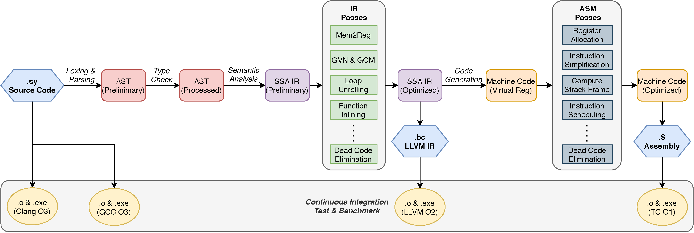

# TrivialCompiler

[](https://github.com/TrivialCompiler/TrivialCompiler)

TrivialCompiler is a compiler written in C++17 that translates SysY (a C-like toy language) into ARM-v7a assembly.



## Compiling

```bash
mkdir build
cmake .. -DCMAKE_BUILD_TYPE=Debug # use Release for better performance, Debug for enabling ASan
make -j
./TrivialCompiler -h # show usage
```

## Usage

```
./TrivialCompiler [-l ir_file] [-S] [-p] [-d] [-o output_file] [-O level] input_file
```

Options:

* `-p`: print the names of all passes to run and exit
* `-d`: enable debug mode (WARNING: will produce excessive amount of output)
* `-O`: set optimization level to `level` (no effect on behaviour currently)
* `-l`: write LLVM IR to `ir_file` and exit, running only frontend
* `-o`: write assembly to `output_file`

You must specify either `-l` or `-o`, or nothing will actually happen.

You could refer to `CMakeLists.txt` on how to converting LLVM IR or assembly to executable file on `ARM-v7a` by using `llc` or `gcc` for assembling and linking.

## Testing

We use `ctest` to automatically test `TrivialCompiler` against several modern compilers. For running tests you need to install the following additional packages and their dependencies:

* `llvm` (to test IR output)
* `g++-arm-linux-gnueabihf`
* `qemu-user` (if not running on ARM-v7a architecture)

Several test cases and corresponding configurable CMake flags are provided:

* `FUNC_TEST` (default `ON`): function test cases provided by the contest committee
* `PERF_TEST` (default `ON`): performance test cases provided by the contest committee
* `CUSTOM_TEST` (default `ON`): test cases written by the authors

And there are more flags to configure whether to use modern compilers to compare with TrivialCompiler

* `GCC` (default `OFF`): use GCC to compile (`-Ofast`) to compare
* `CLANG` (default `OFF`): use Clang (`-Ofast`) to compare, needs `clang` to be installed

After configuring CMake, use `ctest` under your build directory to run all tests.

The results containing stdout and stderr can be located at `build/Testing/Temporary/LastTest.log`. You could use `utils/extract_result.py` to analyze the results and write it into a JSON file.

## Parser Generation

The parser for standard SysY language can be located at `srv/conv/parser.{cpp,hpp}`.

If you want to generate from a modified version of `parser.toml`, first intall `parser_gen`:

```bash
cargo install --git https://github.com/MashPlant/lalr1 --features="clap toml"
```

Then invoke `gen_parser.py` to generate and split the output.

### Notes on `parser_gen` (in Chinese);

现在lexer部分还有一点小问题：因为我输出的表依赖于散列表遍历的顺序，所以每次输出都可能不一样，虽然不会影响结果，但是在版本管理上不是很好看，好像每次都修改了这个文件一样。所以如果重新生成了 `parser.cpp` 但没有修改lexer的话，最好在commit前把 `parser.cpp` 中的 `Lexer::next` 中的那几个表改回原样。
